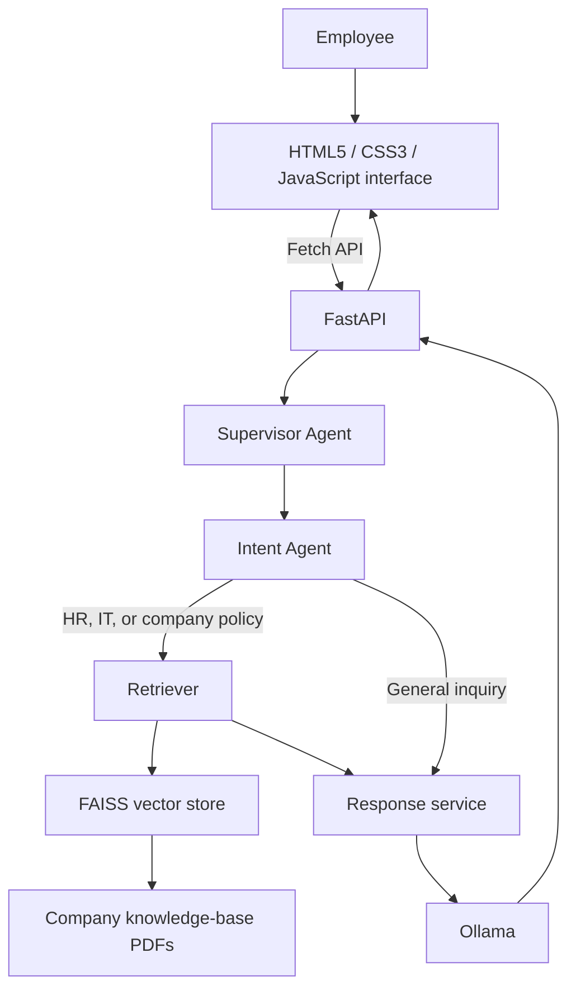

# Enterprise AI Service Desk

> An AI-powered service desk that routes employee questions to the right domain and grounds answers in company knowledge.

   

## Overview

Enterprise AI Service Desk provides a browser-based interface for answering common workplace questions. It classifies each request, assigns it to an appropriate service domain, retrieves relevant company-policy context when needed, and generates a response through a local language model.

## Features

- Multi-agent request routing for HR, IT support, company policy, and general inquiries.
- Intent classification before response generation.
- Retrieval-augmented generation (RAG) over a FAISS knowledge base.
- Local model inference through Ollama.
- Knowledge-base management: upload, list, delete, and reindex PDF documents.
- Responsive HTML5, CSS3, and vanilla JavaScript interface using the Fetch API.
- REST endpoints with interactive API documentation at `/docs` while the backend is running.

## Tech stack

| Area | Technologies |
| --- | --- |
| Frontend | HTML5, CSS3, vanilla JavaScript (ES6), Fetch API |
| Backend | FastAPI, Uvicorn, Pydantic |
| AI | LangChain, Ollama, FAISS, RAG, multi-agent architecture |
| Documents | PDF knowledge base with PyPDF |

## Architecture



See [architecture documentation](docs/architecture.md) for component responsibilities.

## Folder structure

```text
enterprise-ai-service-desk/
├── backend/
│   ├── agents/              # Supervisor and intent-routing agents
│   ├── api/                 # Knowledge-base endpoints
│   ├── rag/                 # Loading, retrieval, and vector-store services
│   ├── services/            # Language-model integrations
│   ├── main.py              # FastAPI application
│   └── requirements.txt
├── frontend/
│   ├── index.html
│   ├── style.css
│   └── app.js
├── docs/                    # Project docs and knowledge-base PDFs
├── screenshots/             # Add interface screenshots here
├── README.md
├── CONTRIBUTING.md
├── CHANGELOG.md
├── LICENSE
└── .gitignore
```

## Installation

### Prerequisites

- Python 3.10 or newer
- [Ollama](https://ollama.com/)

### Backend setup

```powershell
cd backend
python -m venv .venv
.\.venv\Scripts\Activate.ps1
pip install -r requirements.txt
```

Start Ollama in a separate terminal and download the configured model:

```powershell
ollama serve
ollama pull llama3.2
```

The default configuration expects Ollama at `http://localhost:11434` and uses `llama3.2:latest`. You may override these values with `OLLAMA_HOST` and `OLLAMA_MODEL` in a local `.env` file.

## Running the backend

From the `backend/` directory with the virtual environment active:

```powershell
uvicorn main:app --reload
```

The API is available at `http://localhost:8000`. Interactive API documentation is available at `http://localhost:8000/docs`.

## Running the frontend

In a second terminal, serve the static files from the repository root:

```powershell
python -m http.server 5500 --directory frontend
```

Open `http://localhost:5500` in a browser. The frontend is configured to call the backend at `http://localhost:8000`.

## Local development workflow

Use three terminals from the repository root. Start the services in this order.

### Terminal 1 — Ollama

```powershell
ollama serve
```

Before the first run only, download the model in another terminal:

```powershell
ollama pull llama3.2
```

### Terminal 2 — FastAPI backend

```powershell
cd backend
python -m venv .venv
.\.venv\Scripts\Activate.ps1
pip install -r requirements.txt
uvicorn main:app --reload
```

Leave this terminal running. Confirm the backend is ready by opening `http://localhost:8000/health`; it should return `{"status":"healthy"}`.

### Terminal 3 — Static frontend

```powershell
python -m http.server 5500 --directory frontend
```

Open `http://localhost:5500` in your browser. The interface checks the backend health endpoint, loads available knowledge-base documents, and sends user messages to `POST /chat`.

### End-to-end request flow

```text
Browser at http://localhost:5500
  → Fetch API request to FastAPI at http://localhost:8000
  → Supervisor and intent routing
  → FAISS retrieval for HR, IT, and company-policy requests
  → Ollama response generation
  → Response displayed in the browser
```

To stop local services, press `Ctrl+C` in each terminal.

## API endpoints

| Method | Endpoint | Purpose |
| --- | --- | --- |
| GET | `/` | API status message |
| GET | `/health` | Health check |
| POST | `/chat` | Send a service-desk question |
| POST | `/upload` | Upload and index a PDF |
| GET | `/documents` | List knowledge-base PDFs |
| DELETE | `/documents/{filename}` | Delete a PDF and rebuild the index |
| POST | `/reindex` | Rebuild the FAISS index |

Detailed request and response examples are in [docs/api.md](docs/api.md).

## Screenshots

Add product screenshots to `screenshots/` and reference them here.

| Service desk | Knowledge base |
| --- | --- |
| `` | `` |

## Documentation

- [Architecture](docs/architecture.md)
- [API reference](docs/api.md)
- [Deployment guide](docs/deployment.md)
- [Future improvements](docs/future-improvements.md)
- [Contributing](CONTRIBUTING.md)

## GitHub metadata

**Repository description:** AI-powered enterprise service desk with intent routing, local RAG, FAISS knowledge retrieval, and Ollama.

**Topics:** `fastapi`, `ollama`, `langchain`, `faiss`, `rag`, `multi-agent`, `enterprise-ai`, `service-desk`, `knowledge-base`, `javascript`

## Resume-ready summary

- Built an AI-powered enterprise service desk using FastAPI, LangChain, Ollama, and FAISS to answer employee support and policy questions.
- Designed a multi-agent routing workflow that classifies HR, IT support, company-policy, and general inquiries before response generation.
- Implemented RAG over PDF company knowledge bases, including document upload, indexing, retrieval, and reindexing capabilities.
- Delivered a responsive HTML5, CSS3, and vanilla JavaScript interface that integrates with REST APIs through the Fetch API.

## License

This project is licensed under the [MIT License](LICENSE).
