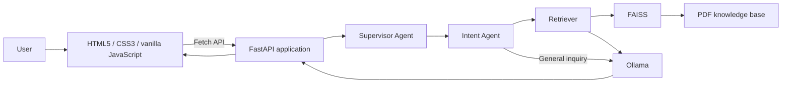

# Architecture

Enterprise AI Service Desk separates the browser interface, API orchestration, request routing, knowledge retrieval, and local model inference into focused components.

## Request flow



1. The browser interface sends a user message to `POST /chat` with the Fetch API.
2. FastAPI passes the message to the supervisor, which obtains an intent and selects the assigned agent label.
3. HR policy, IT support, and company-policy requests retrieve relevant PDF content from the FAISS index.
4. The response service supplies the message and any retrieved context to Ollama.
5. FastAPI returns the intent, assigned agent, and generated response to the browser.

General requests do not require retrieval; they are sent directly to the response service.

## Components

| Component | Responsibility |
| --- | --- |
| `frontend/` | Static HTML5, CSS3, and ES6 JavaScript application. It checks service health, sends chat messages, and manages PDF knowledge-base actions through Fetch API calls. |
| `backend/main.py` | FastAPI application, CORS configuration, core routes, and chat request orchestration. |
| `backend/agents/supervisor_agent.py` | Maps the detected intent to the assigned service agent. |
| `backend/agents/intent_agent.py` | Uses Ollama to classify queries as HR policy, IT support, company policy, or general. |
| `backend/rag/` | Loads PDF documents, builds and updates the FAISS vector store, and retrieves context. |
| `backend/services/` | Encapsulates language-model response generation. |
| `backend/api/upload.py` | Provides the knowledge-base upload, listing, deletion, and reindex endpoints. |
| `docs/` | Stores knowledge-base PDFs and project documentation. |

## Knowledge base lifecycle

PDF files are stored in `docs/`. Uploading a PDF saves it to that directory and appends its chunks to the vector store. Deleting a PDF rebuilds the index from the remaining files. The reindex endpoint rebuilds the index on demand.

Generated local vector-index files belong in `backend/vector_db/` and are excluded from version control. Keep only shareable, non-sensitive sample documents under version control.

## Configuration

`backend/config.py` defines the Ollama host and model. Local values can be supplied through a `.env` file:

```env
OLLAMA_HOST=http://localhost:11434
OLLAMA_MODEL=llama3.2:latest
```

Do not commit `.env` files or internal company documents.
